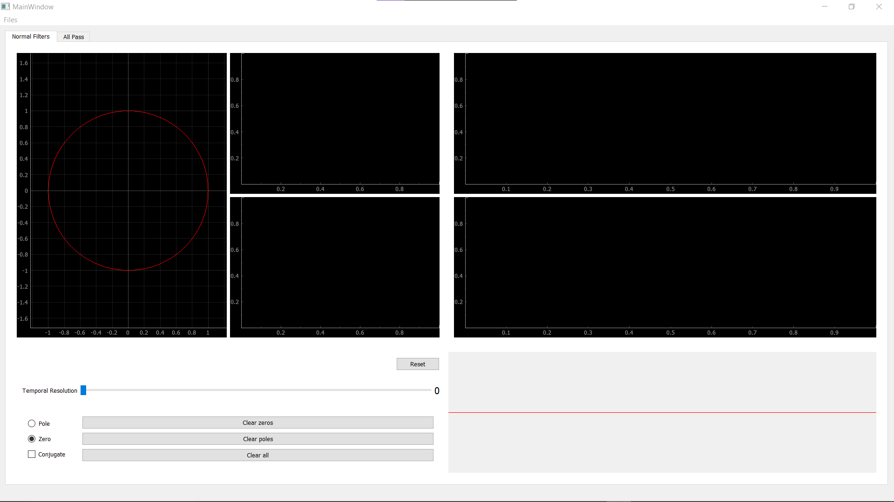

# Digital Filter Design Tool

## Overview:

The Digital Filter Design Tool is a powerful desktop application aimed at facilitating the creation of custom digital filters. Whether you're an engineer, researcher, or hobbyist, this tool provides an intuitive interface for designing filters through zeros-poles placement on the z-plane. With real-time visualization of frequency responses and dynamic signal processing capabilities, users can efficiently craft filters tailored to their specific requirements.

## Features:

- Interactive plot for placing zeros and poles on the z-plane.
- Real-time visualization of frequency response (magnitude and phase).
- Real-time signal processing with adjustable speed.
- Library of pre-defined all-pass filters.
- Custom all-pass filter builder.

## Libraries Used:

- **Python**
- **PyQt5**: For building the desktop application GUI.
- **scipy**: For scientific computing functions, including signal processing.
- **matplotlib**: For additional plotting capabilities.

## Preview:

## Contributors 

<table>
  <tr>
    <td align="center">
      

        <a href="https://github.com/OmarEmad101">
          
           
          <b>Omar Emad</b>
        </a>
      

    </td>
    <td align="center">
      

        <a href="https://github.com/Omarnbl">
          
           
          <b>Omar Nabil</b>
        </a>
      

    </td>
    <td align="center">
      

        <a href="https://github.com/KhaledBadr07">
          
           
          <b>Khaled Badr</b>
        </a>
      

    </td>
    <td align="center">
      

        <a href="https://github.com/merna-abdelmoez">
          
           
          <b>Mirna Abdelmoez</b>
        </a>
      

    </td>
  </tr>
</table>

## Acknowledgments

**This project was supervised by Dr. Tamer Basha & Eng. Abdallah Darwish, who provided invaluable guidance and expertise throughout its development as a part of the Digital Signal Processing course at Cairo University Faculty of Engineering.**

    

